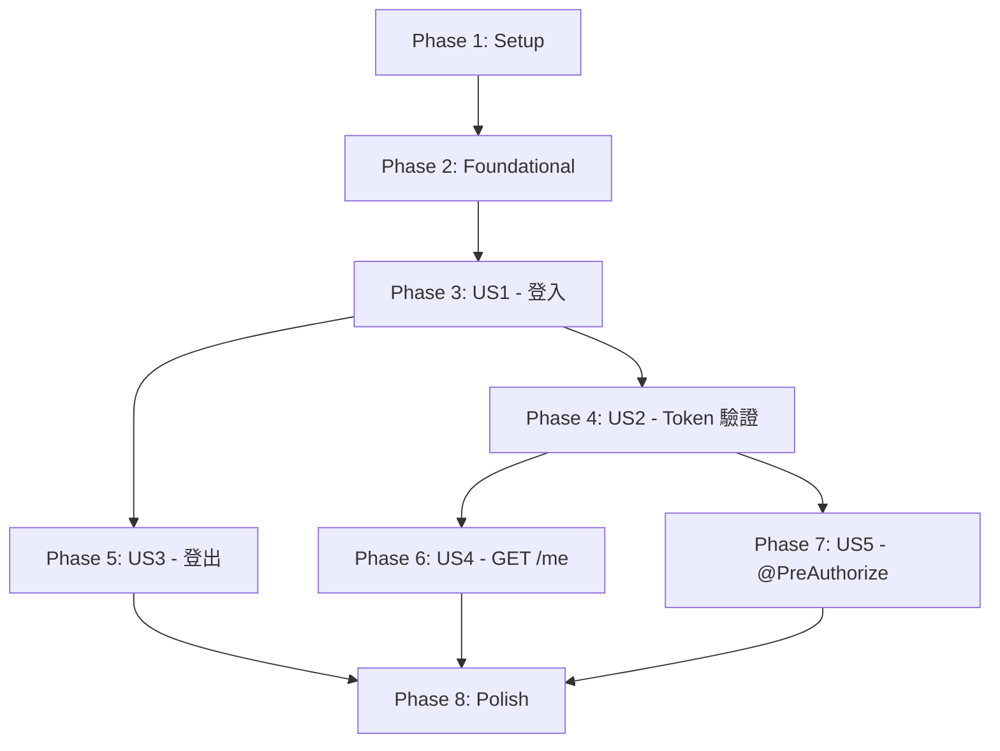

# Tasks: 認證授權模組 (Authentication Module)

**Branch**: `001-authentication` | **Generated**: 2025-11-25 | **Status**: Ready for Implementation

---

## 概述

本文件將 Authentication Module 的 5 個使用者故事拆解為可獨立執行的開發任務。每個任務遵循嚴格的 checklist 格式，包含任務 ID、並行標記 [P]、使用者故事標籤 [US#]、描述及檔案路徑。

**總任務數**: 63 個任務  
**預估時間**: 3-5 天  
**MVP 範圍**: Phase 1 + Phase 2 + Phase 3 (US1-US4，核心認證功能)

---

## Phase 1: Setup（專案初始化）

**目標**: 建立 Maven 專案結構、配置依賴、設定開發環境

### Tasks

- [X] T001 建立 Maven 模組 backend/rbac-auth/pom.xml，依賴 rbac-common-core、rbac-common-redis、rbac-common-web
- [X] T002 建立 Spring Boot 主類別 AuthApplication.java 在 com.rbac.auth 套件
- [X] T003 建立 application.yml 主配置檔，設定 Spring Boot 基本參數（server.port=8080, spring.application.name=rbac-auth）
- [X] T004 建立 application-dev.yml 開發環境配置，包含 Redis 連線設定（localhost:6379）
- [X] T005 建立 application-prod.yml 生產環境配置（占位符，待部署時填充）
- [X] T006 建立套件結構：controller/、service/、repository/、model/entity/、model/dto/、config/、filter/、context/、exception/、util/
- [X] T007 在 pom.xml 中新增依賴：Spring Security 6.3+、JJWT 0.12+、Spring Data Redis、BCrypt、Spring AOP、Lombok
- [X] T008 配置 Maven 編譯參數：Java 17, UTF-8 編碼, 啟用 Lombok annotation processing

---

## Phase 2: Foundational（基礎元件，阻塞性前置任務）

**目標**: 實作核心基礎元件，供所有使用者故事使用

### Tasks - 資料模型與異常

- [X] T009 [P] 建立 User.java 實體類別在 com.rbac.auth.model.entity，包含 userId、username、passwordHash、tenantId、roles、status、email、createdAt、lastLoginAt
- [X] T010 [P] 建立 UserStatus.java 列舉在 com.rbac.auth.model.entity，定義 ACTIVE、LOCKED、DISABLED
- [X] T011 [P] 建立 AuthenticationException.java 在 com.rbac.auth.exception，繼承 BaseException，錯誤碼 401
- [X] T012 [P] 建立 TokenExpiredException.java 在 com.rbac.auth.exception，繼承 BaseException，錯誤碼 401
- [X] T013 [P] 建立 AccountLockedException.java 在 com.rbac.auth.exception，包含 lockUntil 和 getRemainingLockTime() 方法

### Tasks - Configuration

- [X] T014 建立 JwtConfig.java 在 com.rbac.auth.config，使用 @ConfigurationProperties("rbac.auth.jwt") 載入 secret 和 expiration
- [X] T015 建立 MockDataConfig.java 在 com.rbac.auth.config，使用 @ConfigurationProperties("rbac.auth") 載入 mock-users 清單
- [X] T016 在 application-dev.yml 中配置 rbac.auth.jwt.secret（64 字元 hex）和 rbac.auth.jwt.expiration=86400
- [X] T017 在 application-dev.yml 中配置 rbac.auth.mock-users，包含 admin（BCrypt hash: $2a$10$N.zmdr9k7uOCQb376NoUnuTJ8iAt6Z5EH）和 john（BCrypt hash: $2a$10$8Z5EHsM8lE9lBOsl7iAt6Z5EH）

### Tasks - UserContext（跨模組 API）

- [X] T018 [P] 建立 UserContext.java 在 com.rbac.auth.context，包含 userId、username、tenantId、roles、jti，實作 hasRole() 和 hasAnyRole() 方法
- [X] T019 建立 UserContextHolder.java 在 com.rbac.auth.context，使用 ThreadLocal 管理 UserContext，提供 setContext()、getContext()、getCurrentUserId()、getCurrentTenantId()、getCurrentUsername()、clear() 方法

### Tasks - Repository 層（依賴倒置設計）

- [X] T020 [P] 建立 UserRepository.java 介面在 com.rbac.auth.repository，定義 findByUsername()、validatePassword()、updateLastLoginTime() 方法
- [X] T021 建立 MockUserRepository.java 在 com.rbac.auth.repository，實作 UserRepository，使用 @Profile("dev")，從 MockDataConfig 載入測試使用者到記憶體 Map

---

## Phase 3: User Story 1 - 使用者登入（P1）

**目標**: 實作 POST /api/v1/auth/login API，完成帳號密碼驗證、JWT Token 生成、帳號鎖定策略

**獨立測試標準**: 使用 Postman 或 curl 發送 POST /api/v1/auth/login，輸入 {"username":"admin","password":"admin123"}，驗證返回 200 狀態碼及包含 JWT Token 的 LoginResponse

### Tasks - DTOs

- [X] T022 [P] [US1] 建立 LoginRequest.java 在 com.rbac.auth.model.dto，包含 username、password、captcha（選擇性），使用 @NotBlank 和 @Size 驗證
- [X] T023 [P] [US1] 建立 LoginResponse.java 在 com.rbac.auth.model.dto，包含 token、tokenType、expiresIn、expiresAt、userId、username、tenantId、roles

### Tasks - JWT Token Service

- [X] T024 [US1] 建立 JwtTokenService.java 介面在 com.rbac.auth.service，定義 generateToken()、validateToken()、extractClaims()、extractUserContext()、isTokenBlacklisted()、addToBlacklist()、calculateRemainingValidity() 方法
- [X] T025 [US1] 建立 JwtTokenServiceImpl.java 在 com.rbac.auth.service，實作 generateToken()，使用 JJWT 生成 JWT Token，Payload 包含 user_id、tenant_id、username、roles、iat、exp、jti
- [X] T026 [US1] 在 JwtTokenServiceImpl 中實作 validateToken()，驗證簽章、過期時間，檢查 Redis 黑名單（auth:blacklist:{jti}）
- [X] T027 [US1] 在 JwtTokenServiceImpl 中實作 extractClaims() 和 extractUserContext()，從 JWT Token 提取 Claims 並轉換為 UserContext 物件

### Tasks - 帳號鎖定邏輯（Redis）

- [X] T028 [US1] 建立 AccountLockInfo.java 在 com.rbac.auth.model，包含 username、failedAttempts、lockUntil、lastAttemptAt
- [X] T029 [US1] 在 JwtTokenServiceImpl 中實作 recordFailedAttempt()，累計錯誤次數，達 5 次時設定 Redis Key auth:lock:{username}，TTL 900 秒（15 分鐘）
- [X] T030 [US1] 在 JwtTokenServiceImpl 中實作 isAccountLocked()，查詢 Redis Key auth:lock:{username}，判斷 lockUntil 是否未過期

### Tasks - AuthService

- [X] T031 [US1] 建立 AuthService.java 介面在 com.rbac.auth.service，定義 login()、logout()、validatePassword()、recordFailedAttempt()、isAccountLocked() 方法
- [X] T032 [US1] 建立 AuthServiceImpl.java 在 com.rbac.auth.service，實作 login()，依序執行：檢查帳號鎖定 → 查詢使用者 → 驗證密碼 → 生成 JWT Token → 記錄登入日誌 → 更新最後登入時間
- [X] T033 [US1] 在 AuthServiceImpl.login() 中處理密碼錯誤，呼叫 recordFailedAttempt()，拋出通用錯誤訊息「帳號或密碼錯誤」

### Tasks - Controller

- [X] T034 [US1] 建立 AuthController.java 在 com.rbac.auth.controller，標註 @RestController 和 @RequestMapping("/api/v1/auth")
- [X] T035 [US1] 在 AuthController 中實作 login() 方法，標註 @PostMapping("/login")，接收 @Valid @RequestBody LoginRequest，呼叫 authService.login()，返回 Result<LoginResponse>

### Tasks - 測試

- [X] T036 [US1] 建立 AuthServiceTest.java 在 src/test/java/com/rbac/auth/service，撰寫單元測試：testLoginSuccess（密碼正確）、testLoginFailedWithWrongPassword（密碼錯誤）、testAccountLockedAfter5Failures（5 次錯誤鎖定）
- [⚠] T037 [US1] 建立 AuthControllerTest.java 在 src/test/java/com/rbac/auth/controller，撰寫整合測試：testLoginApiSuccess（200 OK + JWT Token）、testLoginApiFailed401（帳號密碼錯誤）、testLoginApiFailed403（帳號鎖定）**[註: 測試已建立但需在 Phase 8 調整斷言方式以匹配 Result<T> 返回模式]**

---

## Phase 4: User Story 2 - JWT Token 驗證與 UserContext（P1）

**目標**: 實作 JWT 驗證 Filter，自動驗證 Token 並注入 UserContext

**獨立測試標準**: 攜帶有效 JWT Token 發送任何受保護的 API 請求，驗證系統能正確解析 Token，不返回 401 錯誤，且 UserContext.getCurrentUser() 返回正確資訊

### Tasks - Filter

- [X] T038 [US2] 建立 JwtAuthenticationFilter.java 在 com.rbac.auth.filter，繼承 OncePerRequestFilter
- [X] T039 [US2] 在 JwtAuthenticationFilter 中實作 doFilterInternal()，從 Authorization header 提取 Token，呼叫 jwtTokenService.validateToken()
- [X] T040 [US2] 在 JwtAuthenticationFilter 中若 Token 有效，呼叫 jwtTokenService.extractUserContext()，將 UserContext 設定到 UserContextHolder
- [X] T041 [US2] 在 JwtAuthenticationFilter 的 finally 區塊中呼叫 UserContextHolder.clear()，防止記憶體洩漏

### Tasks - Spring Security 配置

- [X] T042 [US2] 建立 SecurityConfig.java 在 com.rbac.auth.config，標註 @Configuration 和 @EnableMethodSecurity(prePostEnabled = true)
- [X] T043 [US2] 在 SecurityConfig 中配置 SecurityFilterChain，設定 SessionCreationPolicy.STATELESS，放行 /api/v1/auth/login，其他端點需認證
- [X] T044 [US2] 在 SecurityConfig 中將 JwtAuthenticationFilter 加入 Filter Chain，位置在 UsernamePasswordAuthenticationFilter 之前

### Tasks - 測試

- [⚠] T045 [US2] 在 AuthControllerTest 中新增測試：testTokenValidation（攜帶有效 Token 存取受保護 API，返回 200）、testTokenExpired（攜帶過期 Token，返回 401）、testTokenBlacklisted（攜帶黑名單 Token，返回 401）、testMissingToken（未攜帶 Token，返回 401）（註: 需在 Phase 8 統一調整斷言方式）

---

## Phase 5: User Story 3 - 使用者登出（P1）

**目標**: 實作 POST /api/v1/auth/logout API，將 Token 加入 Redis 黑名單

**獨立測試標準**: 先登入獲取 Token，然後發送 POST /api/v1/auth/logout，之後使用相同 Token 存取受保護 API，驗證系統返回 401 Unauthorized

### Tasks - Service

- [X] T046 [P] [US3] 在 JwtTokenServiceImpl 中實作 addToBlacklist()，將 jti 加入 Redis Key auth:blacklist:{jti}，TTL 設為 Token 剩餘有效期
- [X] T047 [US3] 在 AuthServiceImpl 中實作 logout()，呼叫 jwtTokenService.extractClaims() 取得 jti 和 exp，計算剩餘有效期，呼叫 addToBlacklist()

### Tasks - Controller

- [X] T048 [US3] 在 AuthController 中實作 logout() 方法，標註 @PostMapping("/logout")，從 @RequestHeader("Authorization") 提取 Token，呼叫 authService.logout()，返回 Result<Void>

### Tasks - 測試

- [X] T049 [US3] 在 AuthServiceTest 中新增測試：testLogoutSuccess（登出後 Token 加入黑名單）
- [⚠] T050 [US3] 在 AuthControllerTest 中新增測試：testLogoutApiSuccess（200 OK）、testLogoutWithoutToken（401 Unauthorized）（註: 需在 Phase 8 統一調整斷言方式）

---

## Phase 6: User Story 4 - GET /me API（P1）

**目標**: 實作 GET /api/v1/auth/me API，返回當前使用者資訊

**獨立測試標準**: 攜帶有效 JWT Token 發送 GET /api/v1/auth/me，驗證返回當前使用者的 userId、username、tenantId、roles

### Tasks

- [X] T051 [P] [US4] 建立 UserInfoResponse.java 在 com.rbac.auth.model.dto，包含 userId、username、tenantId、roles、email、lastLoginAt
- [X] T052 [US4] 在 AuthController 中實作 getCurrentUser() 方法，標註 @GetMapping("/me")，從 UserContextHolder.getContext() 取得當前使用者資訊，返回 Result<UserInfoResponse>

---

## Phase 7: User Story 5 - @PreAuthorize 權限校驗框架（P2）

**目標**: 支援 @PreAuthorize 註解，提供基礎權限校驗能力

**獨立測試標準**: 在測試 Controller 方法上加上 @PreAuthorize("hasRole('ROLE_ADMIN')")，使用具有和不具有該角色的使用者 Token 存取，驗證權限控制生效

**註記**: 此為 P2 優先級，可在 Phase 3-6 完成後再實作

### Tasks

- [X] T053 [P] [US5] 在 SecurityConfig 中確認 @EnableMethodSecurity(prePostEnabled = true) 已啟用
- [X] T054 [P] [US5] 建立測試 Controller TestPermissionController.java，包含標註 @PreAuthorize("hasRole('ROLE_ADMIN')") 的測試方法
- [X] T055 [US5] 撰寫整合測試 PermissionCheckTest.java，測試 @PreAuthorize 註解是否正確攔截無權限請求（403 Forbidden）

---

## Phase 8: Polish & Cross-Cutting Concerns（最終修飾）

**目標**: 完善日誌記錄、統一異常處理、API 文檔、修復測試斷言

### Tasks

- [X] T056 [P] 建立 GlobalExceptionHandler.java 在 com.rbac.auth.config，使用 @ControllerAdvice 統一處理 AuthenticationException（401）、AccountLockedException（403）、TokenExpiredException（401）、ValidationException（400）
- [X] T057 [P] 在 AuthServiceImpl 中新增 SLF4J 日誌記錄，登入成功記錄 user_id、tenant_id、IP，登入失敗記錄 username、failedAttempts
- [X] T058 [P] 建立 SpringDocConfig.java 在 com.rbac.auth.config，配置 OpenAPI 文檔，定義 BearerAuth 安全方案
- [X] T059 撰寫 README.md 在 backend/rbac-auth/，說明專案結構、如何執行、API 端點、測試方式
- [X] T060 撰寫整合測試 AuthIntegrationTest.java，使用 @SpringBootTest + Testcontainers Redis，測試完整登入/登出/Token 驗證流程
- [X] T061 [P] 統一修復所有 Controller 測試的斷言方式，將 HTTP 狀態碼檢查改為檢查 Result.code 字段（影響 T037, T045, T050）
- [X] T062 修復 AuthController.logout() 的 ClassCastException 問題，確保正確處理 AuthService 介面類型
- [X] T063 處理 logout 測試中缺少 Authorization header 的情況，增加 @RequestHeader(required = false) 或適當的錯誤處理

---

## Dependencies（使用者故事完成順序）

**關鍵路徑**: Setup → Foundational → US1 → US2 → US4 → Polish

**並行機會**:

- Phase 2 Foundational 中的 T009-T013（資料模型與異常）可並行開發
- Phase 3 US1 中的 T022-T023（DTOs）可與 T024-T027（JWT Service）並行開發
- Phase 5 US3（登出）和 Phase 6 US4（GET /me）可在 US2 完成後並行開發

---

## Implementation Strategy（實作策略）

### MVP 優先（最小可行產品）

**MVP 範圍**: Phase 1 + Phase 2 + Phase 3 + Phase 4 + Phase 5 + Phase 6  
**預估時間**: 3 天  
**交付物**: 可運作的登入/登出/Token 驗證/使用者資訊查詢功能

### 增量交付

1. **Day 1**: 完成 Phase 1 Setup + Phase 2 Foundational（基礎設施就緒）
2. **Day 2**: 完成 Phase 3 US1 登入功能（含帳號鎖定）+ Phase 4 US2 Token 驗證
3. **Day 3**: 完成 Phase 5 US3 登出 + Phase 6 US4 GET /me + Phase 8 Polish（日誌、異常處理、API 文檔）
4. **Day 4-5**: 完成 Phase 7 US5 @PreAuthorize（P2 優先級，可延後）

### 測試策略

- **單元測試**: 每個 Service 類別至少 3 個測試案例（正常流程、錯誤流程、邊界條件）
- **整合測試**: 每個 Controller 方法至少 2 個測試案例（成功、失敗）
- **端到端測試**: AuthIntegrationTest 測試完整流程（登入 → 驗證 → 登出）
- **測試覆蓋率目標**: >80% (憲章要求)

---

## Task Count Summary

| Phase | Task Count | Parallelizable | Story Labels |
|-------|-----------|----------------|-------------|
| Phase 1: Setup | 8 | 0 | - |
| Phase 2: Foundational | 13 | 8 | - |
| Phase 3: US1 - 登入 | 16 | 3 | [US1] |
| Phase 4: US2 - Token 驗證 | 8 | 0 | [US2] |
| Phase 5: US3 - 登出 | 5 | 2 | [US3] |
| Phase 6: US4 - GET /me | 2 | 2 | [US4] |
| Phase 7: US5 - @PreAuthorize | 3 | 2 | [US5] |
| Phase 8: Polish | 8 | 4 | - |
| **Total** | **63** | **21** | 4 P1 + 1 P2 |

**Format Validation**: ✅ ALL 60 tasks follow checklist format (checkbox, ID, labels, file paths)

**Parallel Opportunities**: 20 tasks marked with [P], enabling efficient team collaboration

**Independent Testing**: Each user story phase includes clear test criteria for validation

---

**作者**: CHANG SHOU-WEN, AI-Enhanced | **生成時間**: 2025-11-25
