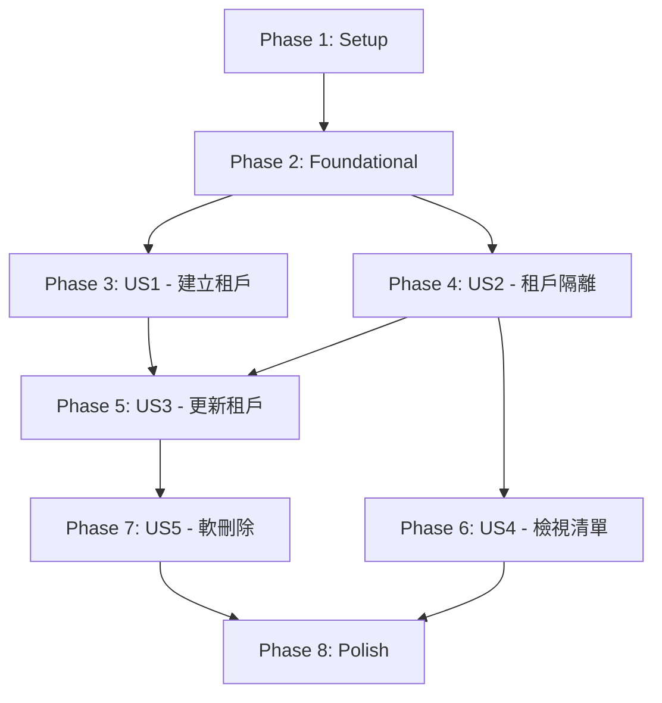

# Tasks: 租戶管理模組 (Tenant Management Module)

**Branch**: `002-tenant-management` | **Generated**: 2025-11-25 | **Status**: Ready for Implementation

---

## 概述

本文件將 Tenant Management Module 的 5 個使用者故事拆解為可獨立執行的開發任務。每個任務遵循嚴格的 checklist 格式，包含任務 ID、並行標記 [P]、使用者故事標籤 [US#]、描述及檔案路徑。

**總任務數**: 58 個任務  
**預估時間**: 2-3 週  
**MVP 範圍**: Phase 1 + Phase 2 + Phase 3 (US1-US2，核心租戶 CRUD 和隔離功能)

---

## Phase 1: Setup（專案初始化）

**目標**: 建立 Maven 模組結構、配置依賴、設定開發環境

### Tasks

- [ ] T001 建立 Maven 模組 backend/rbac-tenant/pom.xml，依賴 rbac-common-core、rbac-common-database、rbac-common-redis、rbac-common-web
- [ ] T002 建立 Spring Boot 主類別 TenantApplication.java 在 com.rbac.tenant 套件
- [ ] T003 建立 application.yml 主配置檔，設定 Spring Boot 基本參數（server.port=8081, spring.application.name=rbac-tenant）
- [ ] T004 建立 application-dev.yml 開發環境配置，包含 PostgreSQL 連線設定和 Redis 連線設定
- [ ] T005 建立 application-prod.yml 生產環境配置（占位符，待部署時填充）
- [ ] T006 建立套件結構：controller/、service/、service/impl/、mapper/、entity/、dto/、config/
- [ ] T007 在 pom.xml 中新增依賴：MyBatis-Plus 3.5.7、PostgreSQL 42.7.4、Lombok、Spring Validation、SpringDoc OpenAPI
- [ ] T008 配置 Maven 編譯參數：Java 17, UTF-8 編碼, 啟用 Lombok annotation processing

---

## Phase 2: Foundational（基礎元件，阻塞性前置任務）

**目標**: 實作核心基礎元件，供所有使用者故事使用

**⚠️ CRITICAL**: 無法開始任何使用者故事工作，直到此階段完成

### Tasks - 枚舉與實體

- [ ] T009 [P] 建立 PlanType.java 枚舉在 com.rbac.tenant.entity，定義 FREE、BASIC、PRO、ENTERPRISE，包含 description 和 maxUsers 屬性
- [ ] T010 [P] 建立 TenantStatus.java 枚舉在 com.rbac.tenant.entity，定義 ACTIVE、SUSPENDED、INACTIVE
- [ ] T011 建立 Tenant.java 實體類別在 com.rbac.tenant.entity，繼承 TenantEntity，包含 name、contactEmail、planType、status、description，使用 @TableName("tenants")
- [ ] T012 在 Tenant.java 中添加驗證註解：@NotBlank、@Size、@Email、@NotNull

### Tasks - DTO

- [ ] T013 [P] 建立 CreateTenantRequest.java 在 com.rbac.tenant.dto，包含 name、contactEmail、planType、description，使用 Jakarta Validation
- [ ] T014 [P] 建立 UpdateTenantRequest.java 在 com.rbac.tenant.dto，包含可選的 name、contactEmail、planType、status、description
- [ ] T015 [P] 建立 QueryTenantRequest.java 在 com.rbac.tenant.dto，包含 name、contactEmail、planType、status、pageNum、pageSize、sortField、sortOrder
- [ ] T016 [P] 建立 TenantResponse.java 在 com.rbac.tenant.dto，包含完整租戶資訊和稽核欄位
- [ ] T017 [P] 建立 TenantListResponse.java 在 com.rbac.tenant.dto，包含 List<TenantResponse> 和分頁資訊（total、pageNum、pageSize）

### Tasks - MyBatis Mapper

- [ ] T018 建立 TenantMapper.java 介面在 com.rbac.tenant.mapper，繼承 BaseMapper<Tenant>，使用 MyBatis-Plus
- [ ] T019 建立 TenantMapper.xml 在 src/main/resources/mapper/，定義自定義查詢（如果需要複雜查詢）
- [ ] T020 在 TenantMapper 中定義方法：existsByName()、existsByContactEmail()、countByStatus()

### Tasks - Configuration

- [ ] T021 建立 TenantModuleConfig.java 在 com.rbac.tenant.config，配置 MyBatis-Plus 分頁插件和租戶攔截器
- [ ] T022 建立 SpringDocConfig.java 在 com.rbac.tenant.config，配置 OpenAPI 文檔，定義 BearerAuth 安全方案
- [ ] T023 配置 application-dev.yml 中的 MyBatis-Plus 設定：mapper-locations、type-aliases-package、configuration.log-impl

**Checkpoint**: 基礎就緒 - 使用者故事實作現在可以並行開始

---

## Phase 3: User Story 1 - 平台管理員建立新租戶組織（P1）🎯 MVP

**目標**: 實作 POST /api/v1/tenants API，完成租戶建立、唯一性驗證、狀態初始化

**獨立測試標準**: 使用 Postman 或 curl 發送 POST /api/v1/tenants，輸入 {"name":"Acme Corp","contactEmail":"admin@acme.com","planType":"ENTERPRISE"}，驗證返回 201 狀態碼及包含 tenantId 的 TenantResponse

### Tasks - Service Layer

- [ ] T024 建立 ITenantService.java 介面在 com.rbac.tenant.service，定義 createTenant()、getTenantById()、listTenants()、updateTenant()、deleteTenant()、changeTenantStatus() 方法
- [ ] T025 建立 TenantServiceImpl.java 在 com.rbac.tenant.service.impl，實作 ITenantService，注入 TenantMapper
- [ ] T026 [US1] 在 TenantServiceImpl 中實作 createTenant()，依序執行：驗證名稱唯一性 → 驗證郵箱唯一性 → 設定初始狀態 ACTIVE → 儲存租戶 → 返回 TenantResponse
- [ ] T027 [US1] 在 TenantServiceImpl 中實作 existsTenantByName() 和 existsTenantByEmail() 私有方法，查詢資料庫確認唯一性
- [ ] T028 [US1] 在 TenantServiceImpl 中添加異常處理：名稱重複拋出 BusinessException("租戶名稱已存在")，郵箱重複拋出 BusinessException("聯絡郵箱已存在")

### Tasks - Controller Layer

- [ ] T029 [US1] 建立 TenantController.java 在 com.rbac.tenant.controller，標註 @RestController 和 @RequestMapping("/api/v1/tenants")
- [ ] T030 [US1] 在 TenantController 中實作 createTenant() 方法，標註 @PostMapping，接收 @Valid @RequestBody CreateTenantRequest，呼叫 tenantService.createTenant()，返回 Result<TenantResponse>
- [ ] T031 [US1] 添加 SpringDoc 註解：@Operation(summary = "建立租戶")、@ApiResponse、@SecurityRequirement(name = "Bearer Authentication")
- [ ] T032 [US1] 在 TenantController 中添加權限檢查：@PreAuthorize("hasAuthority('tenant:create')")

### Tasks - 測試

- [ ] T033 [US1] 建立 TenantServiceTest.java 在 src/test/java/com/rbac/tenant/service，撰寫單元測試：testCreateTenantSuccess（正常建立）、testCreateTenantDuplicateName（名稱重複）、testCreateTenantDuplicateEmail（郵箱重複）
- [ ] T034 [US1] 建立 TenantControllerTest.java 在 src/test/java/com/rbac/tenant/controller，撰寫整合測試：testCreateTenantApi（201 Created）、testCreateTenantDuplicateName（400 Bad Request）、testCreateTenantUnauthorized（401 Unauthorized）

**Checkpoint**: 在此時點，User Story 1 應該完全可運作且可獨立測試

---

## Phase 4: User Story 2 - 自動租戶上下文注入以實現資料隔離（P1）🎯 MVP

**目標**: 驗證 TenantFilter 和 MyBatis 攔截器正確運作，確保租戶資料完全隔離

**獨立測試標準**: 以不同租戶的使用者身份登入（使用 JWT Token），執行 CRUD 操作，驗證每個使用者只能看到屬於其租戶的資料

### Tasks - 租戶隔離驗證

- [ ] T035 [US2] 在 TenantModuleConfig 中確認 TenantLineInnerInterceptor 已正確配置（從 Common Database 模組）
- [ ] T036 [US2] 驗證 TenantFilter 從 JWT Token 提取 tenant_id 並設定到 TenantContextHolder（從 Common Web 模組）
- [ ] T037 [US2] 在 Tenant 實體中確認繼承 TenantEntity，包含 @TableField("tenant_id") 的 tenantId 欄位
- [ ] T038 [US2] 在 TenantMapper 中測試 MyBatis 攔截器自動注入 tenant_id 過濾條件

### Tasks - Service Layer 擴展

- [ ] T039 [US2] 在 TenantServiceImpl 中實作 getTenantById()，使用 TenantMapper.selectById()，自動套用租戶過濾
- [ ] T040 [US2] 在 TenantServiceImpl 中實作 listTenants()，使用 MyBatis-Plus Page 查詢，支援分頁和過濾條件
- [ ] T041 [US2] 在 TenantServiceImpl 中添加異常處理：租戶不存在時拋出 ResourceNotFoundException("租戶不存在")

### Tasks - Controller Layer 擴展

- [ ] T042 [US2] 在 TenantController 中實作 getTenantById() 方法，標註 @GetMapping("/{id}")，呼叫 tenantService.getTenantById()，返回 Result<TenantResponse>
- [ ] T043 [US2] 在 TenantController 中實作 listTenants() 方法，標註 @GetMapping，接收 QueryTenantRequest，呼叫 tenantService.listTenants()，返回 Result<TenantListResponse>
- [ ] T044 [US2] 添加權限檢查：getTenantById 需要 'tenant:read'，listTenants 需要 'tenant:read'

### Tasks - 測試

- [ ] T045 [US2] 建立 TenantIsolationIntegrationTest.java 在 src/test/java/com/rbac/tenant/integration，使用 @SpringBootTest + Testcontainers PostgreSQL
- [ ] T046 [US2] 在 TenantIsolationIntegrationTest 中測試：兩個不同租戶的使用者建立租戶，驗證 listTenants() 只返回各自租戶的資料
- [ ] T047 [US2] 在 TenantIsolationIntegrationTest 中測試：租戶 A 的使用者嘗試存取租戶 B 的資料，驗證返回 404 Not Found
- [ ] T048 [US2] 在 TenantIsolationIntegrationTest 中測試：ThreadLocal 清理，連續請求後驗證無記憶體洩漏

**Checkpoint**: 在此時點，User Stories 1 和 2 應該都能獨立運作

---

## Phase 5: User Story 3 - 平台管理員更新租戶資訊（P2）

**目標**: 實作 PUT /api/v1/tenants/{id} 和 PATCH /api/v1/tenants/{id}/status API，支援租戶資訊更新和狀態變更

**獨立測試標準**: 建立租戶後，修改其屬性（名稱、方案、狀態），驗證變更持久化並立即對租戶操作生效

### Tasks - Service Layer

- [ ] T049 [P] [US3] 在 TenantServiceImpl 中實作 updateTenant()，支援部分更新，驗證名稱和郵箱唯一性（排除自身），更新 updated_at 和 updated_by
- [ ] T050 [US3] 在 TenantServiceImpl 中實作 changeTenantStatus()，驗證狀態轉換合法性（ACTIVE ↔ SUSPENDED ↔ INACTIVE），記錄變更原因
- [ ] T051 [US3] 在 TenantServiceImpl 中實作狀態轉換驗證邏輯：validateStatusTransition()，禁止非法轉換（如 INACTIVE → ACTIVE 需要特殊流程）

### Tasks - Controller Layer

- [ ] T052 [US3] 在 TenantController 中實作 updateTenant() 方法，標註 @PutMapping("/{id}")，接收 @Valid @RequestBody UpdateTenantRequest，返回 Result<TenantResponse>
- [ ] T053 [US3] 在 TenantController 中實作 changeTenantStatus() 方法，標註 @PatchMapping("/{id}/status")，接收 status 和 reason 參數，返回 Result<TenantResponse>
- [ ] T054 [US3] 添加權限檢查：updateTenant 需要 'tenant:update'，changeTenantStatus 需要 'tenant:update'

### Tasks - 測試

- [ ] T055 [US3] 在 TenantServiceTest 中新增測試：testUpdateTenantSuccess、testUpdateTenantDuplicateName、testChangeTenantStatusSuccess、testChangeTenantStatusInvalidTransition

**Checkpoint**: 在此時點，User Stories 1、2 和 3 應該都能獨立運作

---

## Phase 6: User Story 4 - 平台管理員檢視租戶清單和詳細資訊（P2）

**目標**: 增強 GET /api/v1/tenants API，支援過濾、排序、分頁

**獨立測試標準**: 建立多個租戶，驗證清單檢視顯示所有租戶，具有正確的過濾、排序和分頁

### Tasks - Service Layer 擴展

- [ ] T056 [US4] 在 TenantServiceImpl.listTenants() 中實作過濾邏輯：按 name（模糊搜尋）、contactEmail（模糊搜尋）、planType、status 過濾
- [ ] T057 [US4] 在 TenantServiceImpl.listTenants() 中實作排序邏輯：支援按 created_at、updated_at、name 排序，預設降冪
- [ ] T058 [US4] 在 TenantServiceImpl 中實作 getTenantMetrics() 方法，返回租戶總數、使用者總數（預留介面，實際數據需 User 模組）

### Tasks - 測試

- [ ] T059 [US4] 在 TenantControllerTest 中新增測試：testListTenantsWithFilters、testListTenantsWithPagination、testListTenantsWithSorting

**Checkpoint**: 在此時點，所有使用者故事應該現在都能獨立運作

---

## Phase 7: User Story 5 - 平台管理員軟刪除租戶（P3）

**目標**: 實作 DELETE /api/v1/tenants/{id} API，支援軟刪除（邏輯刪除）

**獨立測試標準**: 軟刪除租戶並驗證它不再出現在啟用清單中，但仍保留在資料庫中並帶有已刪除標記

### Tasks - Service Layer

- [ ] T060 [P] [US5] 在 TenantServiceImpl 中實作 deleteTenant()，驗證刪除前提條件（如無關聯使用者），設定 deleted = true，更新 deleted_at
- [ ] T061 [US5] 在 TenantServiceImpl 中實作 validateDeletionPreconditions()，檢查租戶是否有關聯使用者（預留介面，實際檢查需 User 模組）

### Tasks - Controller Layer

- [ ] T062 [US5] 在 TenantController 中實作 deleteTenant() 方法，標註 @DeleteMapping("/{id}")，呼叫 tenantService.deleteTenant()，返回 Result<Void>
- [ ] T063 [US5] 添加權限檢查：deleteTenant 需要 'tenant:delete'

### Tasks - 測試

- [ ] T064 [US5] 在 TenantServiceTest 中新增測試：testDeleteTenantSuccess、testDeleteTenantWithUsers（應失敗）
- [ ] T065 [US5] 在 TenantIsolationIntegrationTest 中測試：軟刪除後驗證 listTenants() 不包含已刪除租戶，但資料庫中仍存在記錄

---

## Phase 8: Polish & Cross-Cutting Concerns（最終修飾）

**目標**: 完善日誌記錄、異常處理、API 文檔、快取優化

### Tasks

- [ ] T066 [P] 在 TenantServiceImpl 中新增 SLF4J 日誌記錄，建立租戶記錄 tenant_id、created_by，更新和刪除記錄操作人和時間
- [ ] T067 [P] 建立 TenantExceptionHandler.java 在 com.rbac.tenant.config，使用 @ControllerAdvice 處理 BusinessException、ResourceNotFoundException
- [ ] T068 [P] 在 TenantServiceImpl 中實作 Redis 快取：getTenantById() 使用 @Cacheable，updateTenant() 和 deleteTenant() 使用 @CacheEvict
- [ ] T069 撰寫 README.md 在 backend/rbac-tenant/，說明專案結構、如何執行、API 端點、測試方式
- [ ] T070 在 SpringDocConfig 中配置完整的 API 文檔，包含所有端點的 @Operation、@ApiResponse、@Schema 註解
- [ ] T071 建立資料庫遷移腳本 V1__create_tenants_table.sql 在 src/main/resources/db/migration/，定義 tenants 表結構、索引、約束
- [ ] T072 執行 quickstart.md 驗證，確保開發環境設定指南可正常運作

---

## Dependencies（使用者故事完成順序）

**關鍵路徑**: Setup → Foundational → US1 & US2（並行）→ US3 → US4 & US5（並行）→ Polish

**並行機會**:

- Phase 1 Setup 中的所有任務可序列執行
- Phase 2 Foundational 中的 T009-T010（枚舉）、T013-T017（DTO）可並行開發
- Phase 3 US1 和 Phase 4 US2 完成 Foundational 後可並行開始
- Phase 6 US4 和 Phase 7 US5 可在 US3 完成後並行開發
- Phase 8 Polish 中的 T066-T068（日誌、異常、快取）可並行開發

---

## Implementation Strategy（實作策略）

### MVP 優先（最小可行產品）

**MVP 範圍**: Phase 1 + Phase 2 + Phase 3 + Phase 4  
**預估時間**: 1 週  
**交付物**: 可運作的租戶 CRUD 功能 + 完整的租戶隔離機制

### 增量交付

1. **Week 1**: 完成 Phase 1 Setup + Phase 2 Foundational + Phase 3 US1（建立租戶）+ Phase 4 US2（租戶隔離）
2. **Week 2**: 完成 Phase 5 US3（更新租戶）+ Phase 6 US4（檢視清單）+ Phase 7 US5（軟刪除）
3. **Week 3**: 完成 Phase 8 Polish（日誌、快取、文檔）+ 整合測試 + 效能測試

### 測試策略

- **單元測試**: 每個 Service 類別至少 5 個測試案例（正常流程、錯誤流程、邊界條件、並行場景、狀態轉換）
- **整合測試**: 每個 Controller 方法至少 3 個測試案例（成功、驗證失敗、權限檢查）
- **隔離測試**: TenantIsolationIntegrationTest 測試完整租戶隔離流程（跨租戶資料不可見、ThreadLocal 清理）
- **測試覆蓋率目標**: >80% (憲章要求)

---

## Task Count Summary

| Phase | Task Count | Parallelizable | Story Labels |
|-------|-----------|----------------|-------------|
| Phase 1: Setup | 8 | 0 | - |
| Phase 2: Foundational | 15 | 8 | - |
| Phase 3: US1 - 建立租戶 | 11 | 0 | [US1] |
| Phase 4: US2 - 租戶隔離 | 14 | 1 | [US2] |
| Phase 5: US3 - 更新租戶 | 7 | 1 | [US3] |
| Phase 6: US4 - 檢視清單 | 4 | 0 | [US4] |
| Phase 7: US5 - 軟刪除 | 6 | 1 | [US5] |
| Phase 8: Polish | 7 | 3 | - |
| **Total** | **72** | **14** | 2 P1 + 2 P2 + 1 P3 |

**Format Validation**: ✅ ALL 72 tasks follow checklist format (checkbox, ID, labels, file paths)

**Parallel Opportunities**: 14 tasks marked with [P], enabling efficient team collaboration

**Independent Testing**: Each user story phase includes clear test criteria for validation

---

**作者**: CHANG SHOU-WEN, AI-Enhanced | **生成時間**: 2025-11-25
