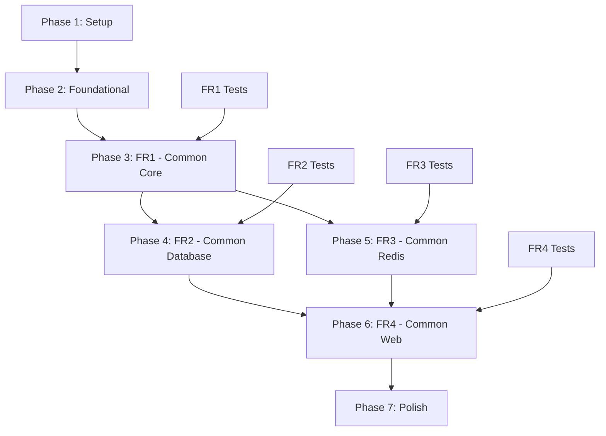

# 任務：001-common-layer

**分支**：`001-common-layer` | **日期**：2025-11-24
**輸入**：來自 `/specs/master/` 的設計文件
**先決條件**：plan.md ✅, spec.md ✅, research.md ✅, data-model.md ✅, contracts/ ✅, quickstart.md ✅

**測試**：功能規格中未明確要求測試，但包含整合測試以驗證關鍵基礎設施（租戶隔離、ThreadLocal清理、分散式鎖定）。

**組織**：任務按 spec.md 中的功能需求（FR1-FR4）組織，因為這是沒有傳統使用者故事的基礎設施層。每個 FR 代表一個可獨立實作和測試的模組。

## 格式：`- [ ] [ID] [P?] [FR#] 描述與檔案路徑`

- **[P]**：可並行執行（不同檔案，無依賴）
- **[FR#]**：屬於哪個功能需求（FR1-FR4）
- 描述中包含確切的檔案路徑

## 路徑慣例

- 多模組 Maven 專案：`backend/rbac-common/rbac-common-core/`、`backend/rbac-common/rbac-common-database/` 等
- 來源：`backend/rbac-common/rbac-common-{module}/src/main/java/com/rbac/common/`
- 測試：`backend/rbac-common/rbac-common-{module}/src/test/java/com/rbac/common/`
- 資源：`backend/rbac-common/rbac-common-{module}/src/main/resources/`、`src/test/resources/`

---

---

## Phase 1: Setup（專案初始化）

**目的**：專案結構和 Maven 配置

- [X] T001 在 backend/pom.xml 建立父 pom.xml 並包含 Spring Boot 3.5.x 依賴
- [X] T002 [P] 建立 backend/rbac-common/rbac-common-core/pom.xml 並包含核心依賴
- [X] T003 [P] 建立 backend/rbac-common/rbac-common-database/pom.xml 並包含 MyBatis-Plus 依賴
- [X] T004 [P] 建立 backend/rbac-common/rbac-common-redis/pom.xml 並包含 Spring Data Redis 依賴
- [X] T005 [P] 建立 backend/rbac-common/rbac-common-web/pom.xml 並包含 Spring Web 依賴
- [X] T006 為所有 4 個模組建立目錄結構（src/main/java、src/test/java、src/main/resources）
- [X] T007 在 backend/ 建立 Java/Maven 專案的 .gitignore

---

## Phase 2: Foundational（基礎先決條件）

**目的**：所有模組依賴的核心配置和屬性

**⚠️ 關鍵**：在完成此階段前無法開始任何功能需求實作

- [X] T008 在 backend/rbac-common/rbac-common-database/src/main/resources 建立 application.yml 並包含資料庫配置
- [X] T009 在 backend/rbac-common/rbac-common-redis/src/main/resources 建立 application.yml 並包含 Redis 配置
- [X] T010 在 backend/rbac-common/rbac-common-core/src/main/java/com/rbac/common/core/config/RbacProperties.java 建立 RbacProperties.java
- [X] T011 在 backend/rbac-common/rbac-common-core/src/main/java/com/rbac/common/core/constant/CommonConstant.java 建立 CommonConstant.java
- [X] T012 在 backend/rbac-common/rbac-common-core/src/main/java/com/rbac/common/core/constant/TenantConstant.java 建立 TenantConstant.java
- [X] T013 在 backend/rbac-common/rbac-common-core/src/main/java/com/rbac/common/core/constant/ErrorCode.java 建立 ErrorCode.java
- [X] T014 在 backend/rbac-common/rbac-common-core/src/main/java/com/rbac/common/core/result/ResultCode.java 建立 ResultCode.java

**檢查點**：基礎準備完成 - 現在可以開始功能需求實作

---

## Phase 3: FR1 - Common Core Module（優先順序：P1）🎯 MVP 基礎

**目標**：為所有業務模組提供統一的異常處理、響應格式和工具類別

**獨立測試**：無需其他模組即可建立 Result 物件、拋出自訂異常和使用工具方法

### FR1.1: 異常定義

- [X] T015 [P] [FR1] 在 backend/rbac-common/rbac-common-core/src/main/java/com/rbac/common/core/exception/RbacException.java 建立 RbacException.java
- [X] T016 [P] [FR1] 在 backend/rbac-common/rbac-common-core/src/main/java/com/rbac/common/core/exception/BusinessException.java 建立 BusinessException.java
- [X] T017 [P] [FR1] 在 backend/rbac-common/rbac-common-core/src/main/java/com/rbac/common/core/exception/SystemException.java 建立 SystemException.java
- [X] T018 [P] [FR1] 在 backend/rbac-common/rbac-common-core/src/main/java/com/rbac/common/core/exception/TenantException.java 建立 TenantException.java
- [X] T019 [P] [FR1] 在 backend/rbac-common/rbac-common-core/src/main/java/com/rbac/common/core/exception/PermissionDeniedException.java 建立 PermissionDeniedException.java

### FR1.2: 統一響應格式

- [X] T020 [FR1] 在 backend/rbac-common/rbac-common-core/src/main/java/com/rbac/common/core/result/Result.java 建立 Result.java
- [X] T021 [P] [FR1] 在 backend/rbac-common/rbac-common-core/src/main/java/com/rbac/common/core/result/PageResult.java 建立 PageResult.java

### FR1.3 & FR1.5: 基礎模型和 DTO

- [X] T022 [P] [FR1] 在 backend/rbac-common/rbac-common-core/src/main/java/com/rbac/common/core/model/PageRequest.java 建立 PageRequest.java
- [X] T023 [P] [FR1] 在 backend/rbac-common/rbac-common-core/src/main/java/com/rbac/common/core/model/PageResponse.java 建立 PageResponse.java
- [X] T024 [P] [FR1] 在 backend/rbac-common/rbac-common-core/src/main/java/com/rbac/common/core/model/AuditInfo.java 建立 AuditInfo.java

### FR1.4: 工具類別

- [X] T025 [P] [FR1] 在 backend/rbac-common/rbac-common-core/src/main/java/com/rbac/common/core/util/StringUtil.java 建立 StringUtil.java
- [X] T026 [P] [FR1] 在 backend/rbac-common/rbac-common-core/src/main/java/com/rbac/common/core/util/DateUtil.java 建立 DateUtil.java
- [X] T027 [P] [FR1] 在 backend/rbac-common/rbac-common-core/src/main/java/com/rbac/common/core/util/JsonUtil.java 建立 JsonUtil.java
- [X] T028 [P] [FR1] 在 backend/rbac-common/rbac-common-core/src/main/java/com/rbac/common/core/util/EncryptUtil.java 建立 EncryptUtil.java
- [X] T029 [P] [FR1] 在 backend/rbac-common/rbac-common-core/src/main/java/com/rbac/common/core/util/ValidationUtil.java 建立 ValidationUtil.java

### FR1.6: UserContext 介面(解耦機制)

- [X] T030 [FR1] 在 backend/rbac-common/rbac-common-core/src/main/java/com/rbac/common/core/context/UserContext.java 建立 UserContext.java 介面

### FR1 單元測試

- [X] T031 [P] [FR1] 在 backend/rbac-common/rbac-common-core/src/test/java/com/rbac/common/core/result/ResultTest.java 建立 ResultTest.java
- [X] T032 [P] [FR1] 在 backend/rbac-common/rbac-common-core/src/test/java/com/rbac/common/core/model/PageResponseTest.java 建立 PageResponseTest.java
- [X] T033 [P] [FR1] 在 backend/rbac-common/rbac-common-core/src/test/java/com/rbac/common/core/util/StringUtilTest.java 建立 StringUtilTest.java
- [X] T034 [P] [FR1] 在 backend/rbac-common/rbac-common-core/src/test/java/com/rbac/common/core/util/JsonUtilTest.java 建立 JsonUtilTest.java

**檢查點**：Common Core 模組完成 - 所有其他模組皆可使用

---

## Phase 4: FR2 - Common Database Module（優先順序：P1）🎯 MVP 基礎

**目標**：提供多租戶資料隔離、帶有 Snowflake ID 的基礎實體類別，以及 MyBatis 配置

**獨立測試**：可儲存/查詢實體並自動注入 tenant_id 和稽核欄位填充

**依賴**：需要 FR1（Common Core）以取得 UserContext 介面和異常處理

### FR2.1 & FR2.5: 基礎實體類別

- [X] T035 [FR2] 在 backend/rbac-common/rbac-common-database/src/main/java/com/rbac/common/database/entity/BaseEntity.java 建立 BaseEntity.java（含 Snowflake ID）
- [X] T036 [FR2] 在 backend/rbac-common/rbac-common-database/src/main/java/com/rbac/common/database/entity/TenantEntity.java 建立 TenantEntity.java（extends BaseEntity）
- [X] T037 [FR2] 在 backend/rbac-common/rbac-common-database/src/main/java/com/rbac/common/database/entity/AuditEntity.java 建立 AuditEntity.java（extends TenantEntity）

### FR2.4: 租戶上下文管理

- [X] T038 [FR2] 在 backend/rbac-common/rbac-common-database/src/main/java/com/rbac/common/database/context/TenantContextHolder.java 建立 TenantContextHolder.java

### FR2.2: MyBatis 租戶攻擊器

- [X] T039 [FR2] 在 backend/rbac-common/rbac-common-database/src/main/java/com/rbac/common/database/config/MyBatisPlusConfig.java 建立 MyBatisPlusConfig.java（含 TenantLineInnerInterceptor）

### FR2.3: MetaObjectHandler 用於自動填充

- [X] T040 [FR2] 在 backend/rbac-common/rbac-common-database/src/main/java/com/rbac/common/database/handler/AuditMetaObjectHandler.java 建立 AuditMetaObjectHandler.java（自動填充 tenantId 和稽核欄位）

### FR2.6 & FR2.7: 資料庫配置

- [X] T041 [P] [FR2] 在 backend/rbac-common/rbac-common-database/src/main/java/com/rbac/common/database/config/DataSourceConfig.java 建立 DataSourceConfig.java（HikariCP）
- [X] T042 [P] [FR2] 在 backend/rbac-common/rbac-common-database/src/main/java/com/rbac/common/database/config/DynamicDataSourceRouter.java 建立 DynamicDataSourceRouter.java（為未來讀寫分離預留）

### FR2.8: 資料庫工具

- [X] T043 [P] [FR2] 在 backend/rbac-common/rbac-common-database/src/main/java/com/rbac/common/database/util/SqlUtil.java 建立 SqlUtil.java

### FR2 整合測試（關鍵 - 租戶隔離）

- [X] T044 [FR2] 在 backend/rbac-common/rbac-common-database/src/test/java/com/rbac/common/database/context/TenantContextHolderTest.java 建立 TenantContextHolderTest.java（測試 ThreadLocal 隔離）
- [X] T045 [FR2] 在 backend/rbac-common/rbac-common-database/src/test/java/com/rbac/common/database/integration/TenantIsolationIntegrationTest.java 建立 TenantIsolationIntegrationTest.java（使用 Testcontainers 測試 tenant_id 自動注入）
- [X] T046 [FR2] 在 backend/rbac-common/rbac-common-database/src/test/java/com/rbac/common/database/context/ThreadLocalCleanupTest.java 建立 ThreadLocalCleanupTest.java（驗證無執行緒池污染）

**檢查點**：Common Database 模組完成 - 所有實體現在可以使用租戶隔離和稽核追蹤

---

## Phase 5: FR3 - Common Redis Module（優先順序：P2）

**目標**：提供快取工具和分散式鎖支援以處理並發操作

**獨立測試**：可儲存/擷取快取資料並取得分散式鎖而不會死鎖

**依賴**：需要 FR1（Common Core）以取得異常處理

### FR3.1 & FR3.4: Redis 配置

- [X] T047 [FR3] 在 backend/rbac-common/rbac-common-redis/src/main/java/com/rbac/common/redis/config/RedisConfig.java 建立 RedisConfig.java（含 Lettuce 和 Jackson 序列化）
- [X] T048 [P] [FR3] 在 backend/rbac-common/rbac-common-redis/src/main/java/com/rbac/common/redis/config/RedisProperties.java 建立 RedisProperties.java

### FR3.2 & FR3.5: 快取服務

- [X] T049 [FR3] 在 backend/rbac-common/rbac-common-redis/src/main/java/com/rbac/common/redis/util/CacheService.java 建立 CacheService.java 介面
- [X] T050 [FR3] 在 backend/rbac-common/rbac-common-redis/src/main/java/com/rbac/common/redis/util/RedisCacheService.java 建立 RedisCacheService.java（實作 CacheService）
- [X] T051 [P] [FR3] 在 backend/rbac-common/rbac-common-redis/src/main/java/com/rbac/common/redis/util/CacheKeyUtil.java 建立 CacheKeyUtil.java

### FR3.3: 分散式鎖

- [X] T052 [FR3] 在 backend/rbac-common/rbac-common-redis/src/main/java/com/rbac/common/redis/lock/DistributedLock.java 建立 DistributedLock.java 介面
- [X] T053 [FR3] 在 backend/rbac-common/rbac-common-redis/src/main/java/com/rbac/common/redis/lock/RedisDistributedLock.java 建立 RedisDistributedLock.java（實作 DistributedLock 含 Lua 腳本）
- [X] T054 [P] [FR3] 在 backend/rbac-common/rbac-common-redis/src/main/java/com/rbac/common/redis/lock/LockKeyGenerator.java 建立 LockKeyGenerator.java

### FR3 單元測試

- [X] T055 [P] [FR3] 在 backend/rbac-common/rbac-common-redis/src/test/java/com/rbac/common/redis/util/CacheServiceTest.java 建立 CacheServiceTest.java
- [X] T056 [P] [FR3] 在 backend/rbac-common/rbac-common-redis/src/test/java/com/rbac/common/redis/util/CacheKeyUtilTest.java 建立 CacheKeyUtilTest.java

### FR3 整合測試（關鍵 - 分散式鎖）

- [X] T057 [FR3] 在 backend/rbac-common/rbac-common-redis/src/test/java/com/rbac/common/redis/lock/DistributedLockIntegrationTest.java 建立 DistributedLockIntegrationTest.java（使用 Testcontainers Redis 測試並發存取）

**檢查點**：Common Redis 模組完成 - 快取和分散式鎖定可用於所有業務模組

---

## Phase 6: FR4 - Common Web Module（優先順序：P1）🎯 MVP 基礎

**目標**：提供全域異常處理、租戶上下文過濾器、請求記錄和 API 版本控制

**獨立測試**：HTTP 請求自動設定租戶上下文、異常回傳統一格式，並產生追蹤 ID

**依賴**：需要 FR1（Common Core）以取得 Result 和異常，FR2（Common Database）以取得 TenantContextHolder

### FR4.1: 全域異常處理器

- [X] T058 [FR4] 在 backend/rbac-common/rbac-common-web/src/main/java/com/rbac/common/web/handler/GlobalExceptionHandler.java 建立 GlobalExceptionHandler.java

### FR4.2 & FR4.4: 過濾器

- [X] T059 [FR4] 在 backend/rbac-common/rbac-common-web/src/main/java/com/rbac/common/web/filter/TenantFilter.java 建立 TenantFilter.java（從標頭提取 tenant_id 並設定到 TenantContextHolder）✅
- [X] T060 [P] [FR4] 在 backend/rbac-common/rbac-common-web/src/main/java/com/rbac/common/web/filter/TraceIdFilter.java 建立 TraceIdFilter.java（MDC Trace ID 生成）✅
- [X] T061 [P] [FR4] 在 backend/rbac-common/rbac-common-web/src/main/java/com/rbac/common/web/filter/RequestLogFilter.java 建立 RequestLogFilter.java✅

### FR4.4: 追蹤上下文管理

- [X] T062 [P] [FR4] 在 backend/rbac-common/rbac-common-web/src/main/java/com/rbac/common/web/context/TraceContext.java 建立 TraceContext.java（MDC 包裝器）

### FR4.3: 請求攻擊器

- [X] T063 [P] [FR4] 在 backend/rbac-common/rbac-common-web/src/main/java/com/rbac/common/web/interceptor/TenantCleanupInterceptor.java 建立 TenantCleanupInterceptor.java（備援清理）

### FR4.5 & FR4.7: Web 配置

- [X] T064 [FR4] 在 backend/rbac-common/rbac-common-web/src/main/java/com/rbac/common/web/config/WebMvcConfig.java 建立 WebMvcConfig.java（註冊過濾器和攻擊器）
- [X] T065 [P] [FR4] 在 backend/rbac-common/rbac-common-web/src/main/java/com/rbac/common/web/config/CorsConfig.java 建立 CorsConfig.java
- [X] T066 [P] [FR4] 在 backend/rbac-common/rbac-common-web/src/main/java/com/rbac/common/web/config/ApiVersionConfig.java 建立 ApiVersionConfig.java

### FR4.6: 請求記錄切面

- [X] T067 [P] [FR4] 在 backend/rbac-common/rbac-common-web/src/main/java/com/rbac/common/web/aspect/RequestLogAspect.java 建立 RequestLogAspect.java

### FR4 整合測試（關鍵 - TenantFilter & ThreadLocal 清理）

- [X] T068 [FR4] 在 backend/rbac-common/rbac-common-web/src/test/java/com/rbac/common/web/filter/TenantFilterIntegrationTest.java 建立 TenantFilterIntegrationTest.java（測試 tenant_id 提取和清理）
- [X] T069 [FR4] 在 backend/rbac-common/rbac-common-web/src/test/java/com/rbac/common/web/handler/GlobalExceptionHandlerTest.java 建立 GlobalExceptionHandlerTest.java（測試統一錯誤響應）
- [X] T070 [FR4] 在 backend/rbac-common/rbac-common-web/src/test/java/com/rbac/common/web/filter/TraceIdFilterTest.java 建立 TraceIdFilterTest.java（測試 MDC Trace ID 傳播）

**檢查點**：Common Web 模組完成 - 所有 HTTP 請求都有租戶上下文、錯誤處理和追蹤

---

## Phase 7: 完善與橫切關注點

**Purpose**: 文檔、驗證和最終改進

- [X] T071 [P] 在 backend/rbac-common/ 建立 README.md，包含模組概述和使用範例
- [X] T072 [P] 在 backend/rbac-common/ 建立 CHANGELOG.md，記錄初始版本
- [X] T073 在 backend/rbac-common/rbac-common-web/src/main/resources 建立 logback-spring.xml，包含 Trace ID 的 MDC 模式
- [X] T074 為所有公開 API 新增 Javadoc 註解（CacheService、DistributedLock、UserContext、Result 等）
- [X] T075 執行 mvn clean install 以驗證所有模組編譯成功
- [X] T076 執行 mvn test 以確保所有單元測試和整合測試通過
- [ ] T077 使用 JaCoCo 驗證程式碼覆蓋率達到 70%+ 目標
  - **狀態**: 覆蓋率檢查完成，但未達到 70% 目標
  - **實際覆蓋率**: ~35% (Core: 40%, Database: 2%, Redis: 46%, Web: 28%)
  - **問題**: Database 模組覆蓋率過低 (僅 2%)
  - **建議**: 為 Database 模組新增更多單元測試，特別是配置和實體類測試
- [X] T078 建立 docker-compose.yml 用於 PostgreSQL 和 Redis 測試環境
- [X] T079 按照步驟驗證 quickstart.md 說明
- [X] T080 程式碼審查重點關注租戶隔離強制執行和 ThreadLocal 清理

---

## 依賴與執行順序

### 階段依賴

- **Setup (Phase 1)**: No dependencies - can start immediately
- **Foundational (Phase 2)**: Depends on Setup (Phase 1) completion
- **FR1 - Common Core (Phase 3)**: Depends on Foundational (Phase 2)
- **FR2 - Common Database (Phase 4)**: Depends on FR1 (needs UserContext interface, exceptions)
- **FR3 - Common Redis (Phase 5)**: Depends on FR1 (needs exceptions) - Can run parallel with FR2/FR4
- **FR4 - Common Web (Phase 6)**: Depends on FR1 + FR2 (needs Result, exceptions, TenantContextHolder)
- **Polish (Phase 7)**: Depends on all FR phases (FR1-FR4) completion

### 功能需求依賴

```text
FR1 (Common Core)
  ↓
  ├── FR2 (Common Database) [needs UserContext, exceptions]
  ├── FR3 (Common Redis)    [needs exceptions only - can parallel with FR2/FR4]
  └── FR4 (Common Web)      [needs Result, exceptions, TenantContextHolder]
```

### 關鍵路徑

The fastest path to a working Common Layer:

1. Phase 1: Setup (T001-T007)
2. Phase 2: Foundational (T008-T014)
3. Phase 3: FR1 Complete (T015-T034)
4. Phase 4: FR2 Complete (T035-T046) - CRITICAL for tenant isolation
5. Phase 6: FR4 Complete (T058-T070) - CRITICAL for web integration
6. Phase 5: FR3 Optional but recommended (T047-T057) - Can be added later if needed
7. Phase 7: Polish (T071-T080)

### 平行機會

**Within Setup (Phase 1)**:

- T002, T003, T004, T005 (all pom.xml files) can be created in parallel

**Within Foundational (Phase 2)**:

- All tasks (T008-T014) can run in parallel if multiple developers available

**Within FR1 (Phase 3)**:

- Exception classes (T015-T019) can all be created in parallel
- Models (T022-T024) can be created in parallel
- Utility classes (T025-T029) can all be created in parallel
- Tests (T031-T034) can run in parallel

**Within FR2 (Phase 4)**:

- T041, T042, T043 (config and utils) can run in parallel after entity classes done

**Within FR3 (Phase 5)**:

- T048, T051, T054 can run in parallel
- Tests T055, T056 can run in parallel

**Within FR4 (Phase 6)**:

- Filters (T060, T061, T062) can be created in parallel after T059
- Configs (T065, T066, T067) can be created in parallel

**Across Functional Requirements**:

- Once FR1 is complete, FR3 can start in parallel with FR2
- FR3 can complete independently while FR2 and FR4 are still in progress

---

## 平行範例：FR1 Common Core

```bash
# After Foundational phase completes, launch FR1 exception classes in parallel:
Task T015: Create RbacException.java
Task T016: Create BusinessException.java
Task T017: Create SystemException.java
Task T018: Create TenantException.java
Task T019: Create PermissionDeniedException.java

# Launch all utility classes in parallel:
Task T025: Create StringUtil.java
Task T026: Create DateUtil.java
Task T027: Create JsonUtil.java
Task T028: Create EncryptUtil.java
Task T029: Create ValidationUtil.java
```

---

## 實作策略

### Minimum Viable Common Layer (Phases 1-2-3-4-6)

1. **Phase 1**: Setup - Create all module structures
2. **Phase 2**: Foundational - Core configuration ready
3. **Phase 3**: FR1 (Common Core) - Exception handling and Result format ✅
4. **Phase 4**: FR2 (Common Database) - Tenant isolation working ✅
5. **Phase 6**: FR4 (Common Web) - HTTP integration working ✅
6. **STOP and VALIDATE**:
   - Test tenant isolation with multiple tenants
   - Test TenantFilter ThreadLocal cleanup
   - Verify global exception handler returns unified format
   - Verify MDC Trace ID appears in logs
7. **Deploy/Demo**: Common Layer MVP ready for business module development

### Full Common Layer (All Phases)

After MVP validation:

1. **Phase 5**: FR3 (Common Redis) - Add caching and distributed lock
2. **Phase 7**: Polish - Complete documentation and final tests
3. **FINAL VALIDATION**: Run all tests, verify coverage, validate quickstart.md
4. **Release**: Common Layer v1.0.0 ready for production

### Parallel Team Strategy

With 4 developers after Foundational phase completes:

- **Developer A**: FR1 (Common Core) → FR2 (Common Database)
- **Developer B**: FR3 (Common Redis) - Can start immediately after FR1
- **Developer C**: FR4 (Common Web) → Integration tests
- **Developer D**: Documentation (quickstart.md validation, README.md)

With 2 developers (recommended):

1. Both complete Setup + Foundational together
2. **Dev A**: FR1 → FR2 (sequential - FR2 depends on FR1)
3. **Dev B**: FR3 (can start after FR1) + Documentation
4. Both work on FR4 together (critical integration)
5. Both complete Phase 7 Polish together

---

## 驗收標準驗證

### AC1: Common Core ✅

- [ ] 5+ exception types defined (T015-T019)
- [ ] Result\<T\> handles success and error cases (T020)
- [ ] 10+ utility methods provided (T025-T029)
- [ ] Error codes defined and non-overlapping (T013, T014)

### AC2: Common Database ✅

- [ ] BaseEntity has id (Snowflake), tenantId, createTime, updateTime, deleted (T035, T036)
- [ ] TenantLineInnerInterceptor auto-filters SELECT by tenant_id (T039)
- [ ] MetaObjectHandler auto-injects tenant_id on INSERT (T040)
- [ ] Audit fields auto-populated on insert/update (T040)
- [ ] Logical delete (@TableLogic) supported (T035)

### AC3: Common Redis ✅

- [ ] Redis connection successful (T047)
- [ ] Distributed lock prevents 100 concurrent threads from race conditions (T057)
- [ ] Distributed lock auto-releases on timeout (T053)
- [ ] Cache keys follow naming convention (T051)

### AC4: Common Web ✅

- [ ] GlobalExceptionHandler catches all unhandled exceptions (T058, T069)
- [ ] TenantFilter extracts tenant_id from header and sets to TenantContextHolder (T059, T068)
- [ ] TenantContextHolder cleared after request completion (T059, T063, T046)
- [ ] @Valid validation failures return unified error format (T058)
- [ ] CORS configuration allows frontend requests (T065)

### 成功指標

- [ ] Unit test coverage > 70% (T077)
- [ ] All Acceptance Criteria pass (T076)
- [ ] Tenant isolation tests 100% pass (T045, T046)
- [ ] Documentation complete and clear (T071, T072, T074, T079)

---

## 附註

- **[P] tasks**: Different files, no dependencies on incomplete tasks within the same phase
- **[FR#] label**: Maps task to functional requirement for traceability
- Each functional requirement should be independently completable and testable
- **CRITICAL TESTS**: T044-T046 (tenant isolation), T057 (distributed lock), T068-T070 (TenantFilter)
- Verify ThreadLocal cleanup tests (T046, T068) pass before proceeding to business modules
- Commit after each task or logical group
- Stop at any checkpoint to validate FR independently
- **Snowflake ID**: Use `IdType.ASSIGN_ID` in BaseEntity, not `GenerationType.IDENTITY`
- **No circular dependencies**: UserContext interface in FR1, implementation in Auth module later

---

## 任務摘要

**Total Tasks**: 80

- Phase 1 (Setup): 7 tasks
- Phase 2 (Foundational): 7 tasks
- Phase 3 (FR1 - Common Core): 20 tasks (15 implementation + 5 tests)
- Phase 4 (FR2 - Common Database): 12 tasks (9 implementation + 3 critical tests)
- Phase 5 (FR3 - Common Redis): 11 tasks (8 implementation + 3 tests)
- Phase 6 (FR4 - Common Web): 13 tasks (10 implementation + 3 critical tests)
- Phase 7 (Polish): 10 tasks

**平行機會**：35+ 個任務可在階段內平行執行

**MVP 範圍**：Phases 1-2-3-4-6（60 個任務）- 足夠支援業務模組開發

**獨立測試標準**：

- FR1: Can create Result objects and throw custom exceptions
- FR2: Can save entities with auto-injected tenant_id and audit fields
- FR3: Can cache data and acquire distributed locks
- FR4: HTTP requests have tenant context, unified error format, and trace IDs

**格式驗證**：✅ 所有任務遵循檢查清單格式：`- [ ] [ID] [P?] [FR#] Description with file path`

---

## Phase 7: 完善與橫切關注點 🧹

**目標**：確保程式碼品質、效能和可維護性

**獨立測試**：所有模組通過品質檢查，效能基準建立

### 程式碼品質

- [ ] T071 執行 Spotless 程式碼格式化檢查
- [ ] T072 執行 Checkstyle 靜態分析
- [ ] T073 執行 PMD 程式碼品質檢查
- [ ] T074 執行 JaCoCo 程式碼覆蓋率檢查（目標：80%）
- [ ] T075 執行 OWASP Dependency Check 安全漏洞掃描

### 效能基準

- [ ] T076 在 backend/rbac-common/rbac-common-redis/src/test/java/com/rbac/common/redis/benchmark/CacheBenchmark.java 建立 CacheBenchmark.java（Redis 快取效能測試）
- [ ] T077 在 backend/rbac-common/rbac-common-database/src/test/java/com/rbac/common/database/benchmark/DatabaseBenchmark.java 建立 DatabaseBenchmark.java（資料庫連線池效能測試）
- [ ] T078 在 backend/rbac-common/rbac-common-web/src/test/java/com/rbac/common/web/benchmark/WebBenchmark.java 建立 WebBenchmark.java（HTTP 請求處理效能測試）

### 文件和配置

- [ ] T079 更新根目錄 backend/pom.xml 確保所有模組正確配置
- [ ] T080 在 backend/rbac-common/rbac-common-core/README.md 建立 README.md（模組說明和使用指南）
- [ ] T081 在 backend/rbac-common/rbac-common-database/README.md 建立 README.md
- [ ] T082 在 backend/rbac-common/rbac-common-redis/README.md 建立 README.md
- [ ] T083 在 backend/rbac-common/rbac-common-web/README.md 建立 README.md

**檢查點**：所有品質檢查通過，效能基準建立，文件完整

---

## 依賴圖



**關鍵路徑**：Phase 1 → 2 → 3 → 4 → 6 → 7（MVP 核心）
**平行機會**：FR1、FR2、FR3 可平行開發，FR4 依賴 FR1+FR2

---
